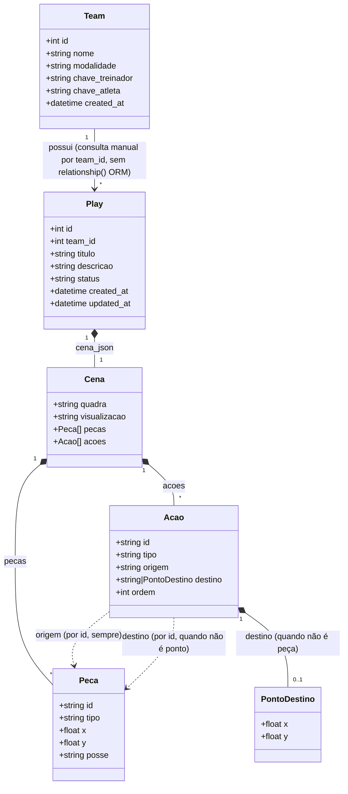
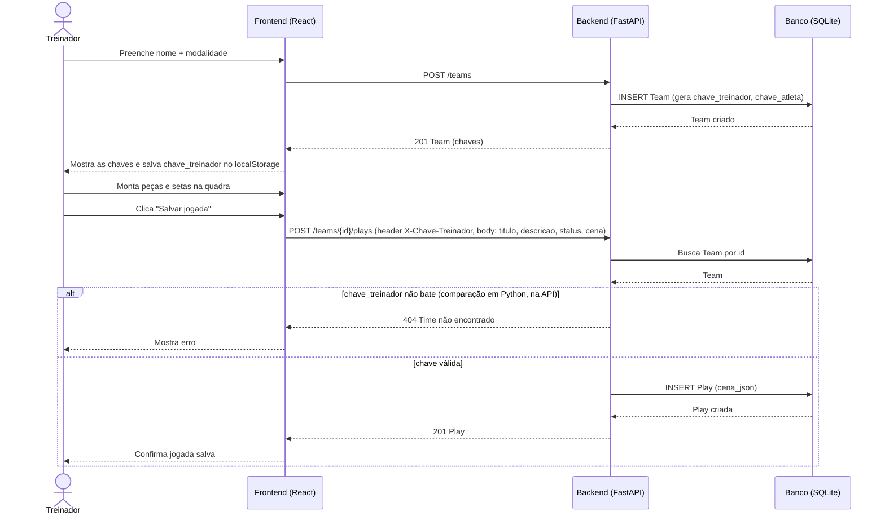
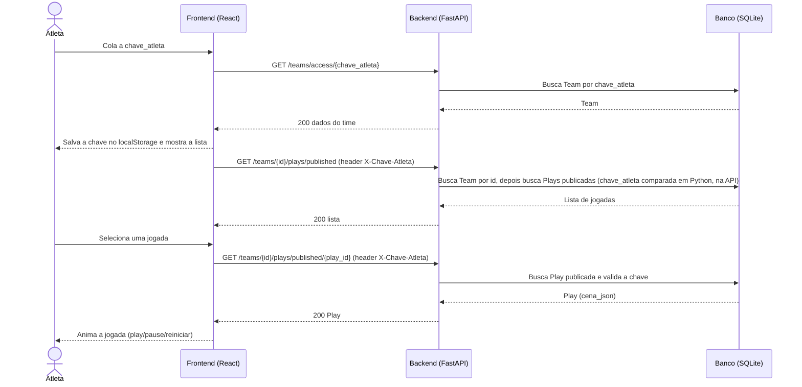

# Prancheta Tática

Sistema web para treinadores de futebol e basquete criarem jogadas táticas animadas e
compartilharem com seus atletas.

**Disciplina:** Engenharia de Software — DCC/UFMG
**Professor:** Marco Tulio Valente
**Trabalho Prático 1 — 2026/2**

---

## Membros e papéis

| Nome completo | Papel |
|---|---|
| *Amanda Silveira Barbosa* | Fullstack |
| *Fabrício Cézar Silva Sobrinho* | Fullstack |
| *Juan Marques Junqueira* | Fullstack |

---

## Objetivo do sistema

Treinadores de times amadores e de base explicam jogadas em quadros brancos ou pranchetas físicas, e o registro se perde assim que o treino acaba. Quem faltou não tem acesso, e atletas com dificuldade de visualização espacial não conseguem reconstruir o movimento a partir de um desenho estático com setas. A Prancheta Tática online surge pra permitir que o treinador posicione jogadores e bola sobre a quadra, desenhe as setas de movimentação e passe (também bloqueio e drible, exclusivas do basquete), e defina a ordem em que cada movimento acontece. As jogadas ficam salvas e o treinador escolhe quais publicar para o time, que acessa por uma chave compartilhada, sem necessidade de cadastro.

---

## Tecnologias

| Camada | Tecnologia |
|---|---|
| Frontend | React 19, TypeScript, Vite, React Router, Tailwind CSS |
| Renderização | SVG nativo (editor e animação) |
| Backend | Python 3.11, FastAPI, Uvicorn |
| ORM / Validação | SQLAlchemy, Pydantic |
| Banco de dados | SQLite |
| Controle de versão | Git + GitHub |
| Agentes de IA | Antigravity, Claude |

**Justificativa da stack:** o formato JSON da cena é a estrutura central do sistema e
atravessa toda a aplicação. No backend, ele é definido como um modelo Pydantic, que valida
automaticamente toda cena recebida e rejeita payloads malformados antes da persistência.
Esse mesmo modelo gera a especificação OpenAPI da API, permitindo que o frontend seja
desenvolvido em paralelo com o contrato sempre atualizado. O React foi mantido no frontend
porque o editor de jogadas é uma interface interativa de manipulação direta, com arraste de
peças e animação em SVG, para a qual a renderização declarativa orientada a estado é
adequada.

---

## Histórias de usuário

1. **Como treinador**, quero criar um time informando nome e modalidade do esporte e receber duas chaves de acesso, uma minha e uma para distribuir aos atletas, para começar a usar o sistema sem precisar criar conta.

2. **Como treinador**, quero posicionar jogadores dos dois times e a bola sobre a quadra
   arrastando as peças, para montar a situação inicial da jogada.

3. **Como treinador**, quero desenhar setas de movimentação e de passe entre as peças e
   definir a ordem de execução de cada uma, para representar a sequência da jogada.

4. **Como treinador**, quero salvar a jogada com título e descrição e escolher se ela está
   publicada ou em rascunho, para só liberar ao time o que já está pronto.

5. **Como atleta**, quero entrar no sistema colando a chave do meu time e ver a lista de
   jogadas publicadas, para consultar as táticas fora do treino.

6. **Como atleta**, quero assistir à animação da jogada com controles de play, pause e
   reinício, para entender a movimentação que um desenho estático não deixa clara.


---

## Cena da jogada

A cena tem a quadra (`futebol` ou `basquete`), as peças (`id`, `tipo`, `x`, `y`) e as ações
(`id`, `tipo`, `origem`, `destino`, `ordem`). O destino pode ser o `id` de uma peça ou um ponto
livre `{ "x", "y" }`. Os tipos de ação seguem a convenção de prancheta:

| Tipo | Desenho | Animação |
|---|---|---|
| `movimentacao` | linha contínua | a peça de origem se desloca |
| `passe` | linha tracejada | a bola vai da origem ao destino |
| `bloqueio` | linha contínua terminando em barra | a peça se desloca e para no bloqueio |
| `drible` | linha ondulada | a peça se desloca levando a bola |

A `ordem` indica o **instante** da ação: ações com a mesma ordem acontecem ao mesmo tempo, e os
instantes rodam em ordem crescente. Na animação, cada instante dura 1 s. O backend rejeita
cenas em que uma peça faz mais de uma ação no mesmo instante, ou em que mais de uma ação move
a bola no mesmo instante (passe, drible ou movimentação da própria bola).

Em qualquer modalidade, a bola tem **posse**: a peça da bola pode ter o campo opcional `posse` com o `id` do
jogador que está com ela (sem o campo, ou `null`, a bola está solta em `x`, `y`). A bola acompanha
quem tem a posse em qualquer deslocamento, só quem tem a posse passa ou dribla, e o passe entrega a
posse ao jogador em cuja área de identificação a ponta da seta cai.

O atleta busca a cena de uma jogada publicada em
`GET /teams/{team_id}/plays/published/{play_id}`, com o header `X-Chave-Atleta`.
`GET /plays/{play_id}` é exclusiva do treinador (header `X-Chave-Treinador`).

---

## Diagramas UML (documentação preliminar)

Rascunhados com apoio de IA a partir do schema e dos endpoints já implementados, e revisados
manualmente antes de entrar no README.

### Diagrama de classes

`Team` e `Play` são entidades persistidas (SQLAlchemy). `Cena`, `Peça`, `Ação` e `PontoDestino`
são o schema Pydantic embutido em `Play.cena_json` — não têm tabela própria.



**Fora do escopo deste diagrama:** os schemas de entrada/saída da API (`TeamCreate`, `TeamResponse`,
`PlayCreate`, `PlayUpdate`, `PlayResponse`, `PlaySummary`, `TeamAccessResponse`, em `schemas/team.py`,
`schemas/play.py` e `schemas/access.py`) não aparecem aqui — são projeções finas de `Team`/`Play`
(ex.: `TeamCreate` só tem `nome` e `modalidade`; `PlaySummary` é `Play` sem `cena_json`) que moldam o
contrato JSON de cada endpoint, sem acrescentar conceito novo ao domínio.

### Diagrama de sequência

Dois fluxos que atravessam os três módulos: o treinador criando o time e salvando uma jogada,
e o atleta acessando com a chave e assistindo a uma jogada publicada.





**Nota sobre onde a validação acontece:** na maioria das rotas com chave (`create_play`, `list_plays`,
`list_published_plays`), o banco só busca o `Team` pelo `id`, e é o código Python na API que compara
a chave recebida — o diagrama do treinador mostra esse caminho, incluindo o erro 404, como exemplo; o
mesmo padrão vale pras outras rotas, só não repetido pra não inflar o diagrama. A exceção é
`GET /teams/{team_id}/plays/published/{play_id}`, cuja query já filtra pela chave direto no `WHERE`
(via `join`) — nesse caso o banco participa mesmo da validação, e o diagrama do atleta reflete isso.

---

## Executando o projeto

```bash
# Backend
cd backend
python -m venv .venv
.venv\Scripts\activate        # Windows (bash: source .venv/Scripts/activate)
pip install -r requirements.txt
uvicorn app.main:app --reload --port 8000

# Frontend (em outro terminal)
cd frontend
npm install
npm run dev
```

O frontend sobe em `http://localhost:5173` e já aponta pro backend em `http://localhost:8000`
por padrão (configurável via `VITE_API_URL`). O backend cria o arquivo `prancheta_tatica.db`
(SQLite) automaticamente na primeira execução.
